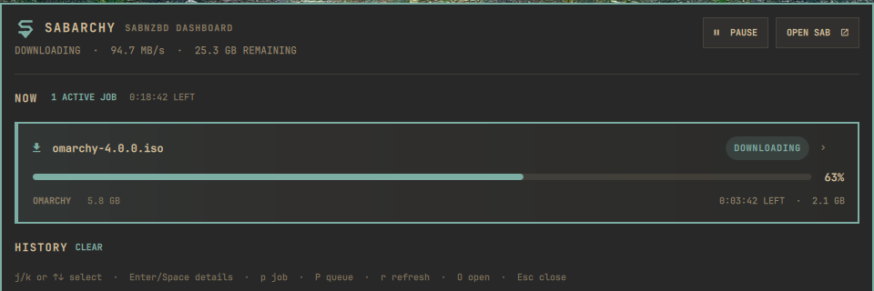
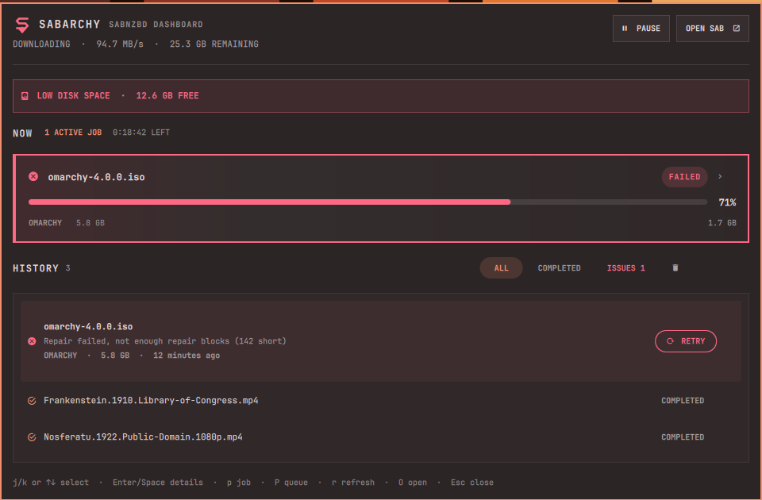
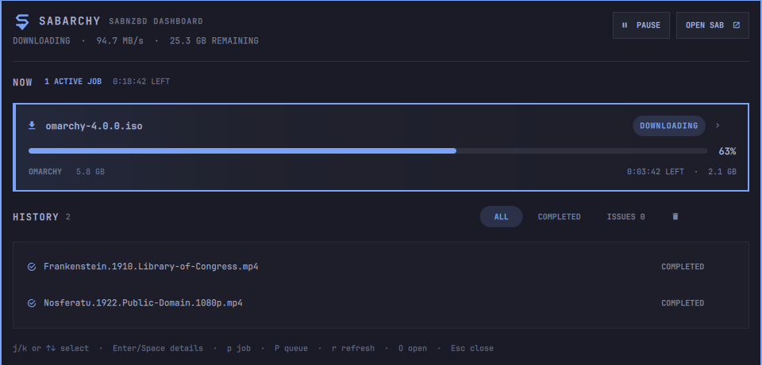

# SABarchy

**The visual SABnzbd dashboard for Omarchy.**

A keyboard-first SABnzbd queue dashboard for Omarchy 4 Quattro. It keeps
active downloads, post-processing, failures, and recent history visible in a
compact theme-aware panel.

## Screenshots



### Failure recovery and low-disk warning



### Tokyo Night



## Features

- Live queue speed, ETA, state, and job progress
- Split downloading, verifying, and unpacking sections in the active pipeline
- Stage-aware colors for download, verify, unpack, and failure states
- Bar failure indicator when history issues need attention
- Desktop notifications for finished and failed downloads, with an optional sound
- Click a notification to open the SABarchy panel
- Open a completed job's folder straight from the history
- Responsive 620–960px layout with virtualized, bounded queue and history lists
- Incremental loading for large queues and histories
- Pause and resume from the bar or panel
- Expand active jobs for category, priority, labels, size, and individual pause/resume
- Keyboard navigation for selecting, expanding, pausing, and collapsing jobs
- A guided first-run state when SABnzbd has not been configured yet
- Preserve the last good snapshot during temporary disconnects and show its age
- Warn when SABnzbd reports less free disk space than the configured threshold
- Filter completed jobs and issues, retry failures, and archive completed history after confirmation
- Opens the SABnzbd web interface directly
- Reads the API key from the local SABnzbd configuration; credentials never
  appear in QML, shell configuration, or process arguments
- Local-only by design

## Requirements

- Omarchy Quattro with `omarchy-shell`
- SABnzbd running locally
- Python 3 (standard library only)

Start SABnzbd once before enabling the widget so it creates
`~/.sabnzbd/sabnzbd.ini`.

## Install

```sh
omarchy plugin add https://github.com/thecdrz/omarchy-sabarchy.git --enable
```

For local development:

```sh
cp -a . ~/.config/omarchy/plugins/io.github.thecdrz.sabarchy
omarchy-shell shell rescanPlugins
omarchy plugin enable io.github.thecdrz.sabarchy
```

## Usage

- Left click the bar widget to open the pipeline
- Right click the widget to pause or resume the queue
- `r` refreshes the panel
- `O` opens SABnzbd
- `f` opens the selected completed job's folder
- `Up`/`Down` or `j`/`k` move through the active queue and recent history
- `Enter` or `Space` expands or collapses the selected job
- `p` pauses or resumes the selected active job
- `P` pauses or resumes the entire queue
- `R` retries a selected failed history item
- `X` collapses open job details
- `Esc` closes the panel

## Configuration

The widget auto-detects `~/.sabnzbd/sabnzbd.ini` and
`~/.config/sabnzbd/sabnzbd.ini`. If SABnzbd uses another location, set
**SABnzbd config path** in the Omarchy bar settings. The refresh interval
defaults to three seconds.

Notifications fire for downloads that finish or fail while the panel is closed;
the first snapshot after a reload only builds a baseline, so existing history
never triggers a burst. Failures arrive as critical notifications, and more than
five finished jobs collapse into one summary. **Play a sound with
notifications** uses the freedesktop sound theme through PipeWire.

**Low disk warning (GB)** defaults to 20 and accepts 0 to disable the warning
entirely. **Open folder** actions launch `xdg-open` on the absolute local path
SABnzbd reports for a completed job.

## Security

The bundled helper reads only SABnzbd's local configuration and contacts only
`127.0.0.1` on SABnzbd's configured port. The API key is used inside the Python
process and is never passed on the command line.

Local HTTPS is supported, including SABnzbd installations using a self-signed
certificate. Certificate verification is relaxed only for the loopback
address; the helper will not contact a remote host.

“Clear completed” uses SABnzbd's normal history archive operation. It does not
delete downloaded files and does not clear failed history items.

## Development previews

The helper includes deterministic snapshots for visual regression testing without live downloads:

```bash
bin/sabnzbd-pipeline-api snapshot --demo downloading
bin/sabnzbd-pipeline-api snapshot --demo clean
bin/sabnzbd-pipeline-api snapshot --demo processing
bin/sabnzbd-pipeline-api snapshot --demo multiple
bin/sabnzbd-pipeline-api snapshot --demo paused
bin/sabnzbd-pipeline-api snapshot --demo failed
bin/sabnzbd-pipeline-api snapshot --demo large
bin/sabnzbd-pipeline-api snapshot --demo not-configured
bin/sabnzbd-pipeline-api snapshot --demo offline
```

To load one in the installed widget, temporarily add `"_demoState": "downloading"` to its entry in `~/.config/omarchy/shell.json`. This private key is intentionally absent from the public settings schema.

Add `"_demoCompact": true` alongside it to force the 620px compact layout. Fixture retry actions are simulated and never sent to SABnzbd.

`"_demoExpandFirst": true` expands the first active job. `"_demoStale": true`
previews the retained-data state. The `failed` fixture also exercises the
low-disk warning. `"_demoExpandHistory": true` expands the first history item.

`"_demoNotify": "completed"`, `"failed"`, or `"both"` sends sample notifications
once the demo snapshot loads, so notification appearance can be checked without
a live download. Fixture retry and open-folder actions are simulated and never
sent to SABnzbd or passed to `xdg-open`.

Run the helper tests with `python -m unittest discover -s tests -v`.

## License

MIT

## Remove

```sh
omarchy plugin remove io.github.thecdrz.sabarchy
```
